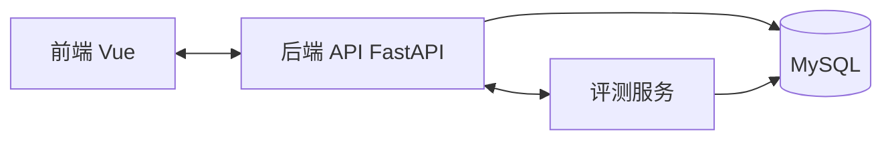

2025 年 3 月我开始做 ndkyOJ。那时候它还不叫这个名字，只是几个想法和一台服务器。

大半年后回头看，这是一个让我被迫面对所有工程问题的项目——不是某个模块的优化，不是某种模式的练习，而是从头到尾把东西搭起来、跑起来、不崩。

## 一开始没想那么多

最初的目标很朴素：做一个能跑代码、能判题、能看排名的系统。

但很快就会发现，OJ 和普通的 CRUD 系统不一样。它有几个天然矛盾：

- **判题是异步且不可控的**。用户提交一段代码，你没法预期它跑多久、会不会占满 CPU、会不会无限循环。
- **结果反馈和前端状态是解耦的**。提交请求返回的是"已经收到"，不是"已经判完"。
- **多人同时交题的时候，判题机不能炸**。但判题机资源有限，你需要决定谁先判、判多久、超了怎么办。

这些矛盾决定了 ndkyOJ 的架构不会是简单的 request-response。

## 先定模块边界

我做的第一件事不是写代码，而是画了一张模块划分图：

每个模块只做一件事：

- **前端**：展示题目、提交代码、查看结果与排名，不做任何判题逻辑
- **后端 API**：处理业务请求、鉴权、参数校验、把提交写入数据库，然后通知评测服务"有新任务"
- **评测服务**：从队列拿任务，在隔离环境里跑代码、对比输出、写回结果
- **数据库**：用户、题目、提交记录、评测结果——全部落库

这个分法不复杂，但很关键。如果一开始把判题逻辑塞进 API 里，后面就拆不动了。

## 中间件先写好

ndkyOJ 是我第一次认真设计中间件体系的项目。

之前写代码的习惯是什么功能写在什么路由里。鉴权？写个函数 call 一下。异常处理？写个 try-catch 包一下。参数校验？写在路由第一行。

当接口超过 20 个，这些就会变成灾难。所以我先把这些横切逻辑抽出来：

- **鉴权中间件**：解析 JWT，挂载 `request.user`，未登录直接拦截
- **异常映射中间件**：所有未捕获异常统一转成标准错误响应，不在路由里写 try-catch
- **参数校验**：FastAPI 的 Pydantic 模型天然支持，不在中间件层
- **请求追踪**：每个请求带上 trace-id，日志里可以串起整条链路

这样路由代码就很干净：接收请求 → 调用业务逻辑 → 返回结果。其他事情框架层面已经做完了。

## 评测服务是最大的坑

评测服务是整个系统里最复杂的部分。它需要：

1. 从队列里取待评测的提交
2. 在隔离环境中编译并运行用户代码
3. 注入测试数据，对比标准输出
4. 设置时间限制和内存限制
5. 把结果写回数据库

难点不在单一功能，而在高并发下的稳定性。

比如一个用户提交了一份死循环代码。你必须在有限时间内 kill 掉它。如果不处理，一个死循环就能把评测机打瘫。

比如同一时间有 20 个人交题。你不能无脑并发 20 个评测进程——CPU 扛不住，而且会导致正常提交的判题时间变长。

我们的策略比较朴素但有效：

- **队列 + 限量并发**：最多同时跑 N 个评测任务，多的排队
- **超时 KILL**：每个任务有硬性时间上限，超了就杀
- **失败重试**：系统级别的失败（比如容器崩了）自动重试，用户级别的（比如答案错误）直接返回
- **监控告警**：评测机挂了要能立刻知道

## CI/CD 跟上

写完功能只是第一步。能稳定更新才是长期维护的关键。

ndkyOJ 用了 Gitee CI + 自建服务器部署：

- 每次 push 触发构建、类型检查、测试
- 通过后自动部署到服务器
- 部署脚本处理依赖安装、数据库迁移、服务重启

因为就我一个人维护，所以自动化越全越好。人肉操作越多，后面就越不想更新。

## 现在回头看

ndkyOJ 不是最漂亮的系统。它有很多地方可以做得更好——容器化隔离不够彻底、前端状态管理可以更细、错误提示可以更友好。

但它是一个完整的东西。从表结构到评测机，从前端到部署，每个环节都经过了真实的踩坑和修复。

对我来说，这个项目的价值不在于它用了什么技术栈，而在于：

- 我知道了怎么从零开始把模块边界定清楚，然后按边界推进
- 我知道了异步系统的坑在哪里——不是单个功能出错，而是状态不一致
- 我知道了 CI/CD 不是"高级玩法"，是一个人维护项目的基本保障

如果你也在做自己的项目，我的建议很简单：**先跑起来，再补牢靠。**

写第一版的时候不需要完美。但你需要在每一版里认真对待那些"差点崩了"的时刻。它们比教科书更诚实。
