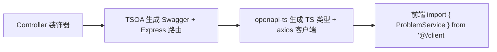
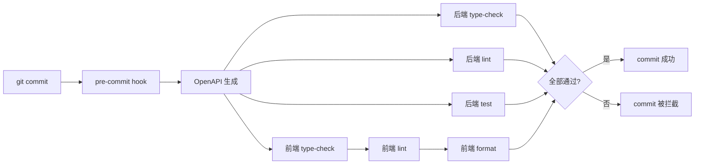

第一版 ndkyOJ 跑了大半年。功能在涨，问题也在涨。

最大的痛点不是功能不够，而是每次改接口都要人工同步三处：后端路由、前端类型、API 文档。改一个字段名，忘了更新前端类型，编译期看不出来，上线才崩。

所以 2025 年底我开始重写后端。语言从 Python 换到 Node.js，ORM 从手写 SQL 换成 Prisma，路由层换成带装饰器的 TSOA。

## 为什么要换语言

不是为了追新技术。

Python + FastAPI 在第一版里表现不差。但当我开始认真做 CI/CD、类型检查、构建流程的时候，Node.js + TypeScript 的生态优势越来越明显：

- **前后端统一语言**：共享类型定义，一个 ESLint 规则管两端
- **pnpm workspace**：一个仓库管前端、后端、评测服务，pre-commit 自动跑全量检查
- **esbuild 构建**：后端冷启动从 tsx 的秒级降到几十毫秒

实际的工程收益比"换语言"这个动作本身大得多。

## 分层架构：给每一层明确的边界

第一版的代码分层比较模糊——路由里偶尔有业务逻辑，业务逻辑里直接写 SQL。功能多了以后，改一个逻辑要翻三四层文件。

重构时我把层次定得很死：

```
HTTP 请求
  → 中间件（auth / 日志 / 异常 / 请求ID）
    → TSOA 生成的路由
      → Controller（只有路由声明，没有逻辑）
        → Service（业务逻辑）
          → Store（Prisma 数据访问）
```

每层只做一件事：

- **Controller**：装饰器声明路由路径、HTTP 方法、鉴权策略、参数校验 schema。TSOA 从装饰器自动生成 Swagger 和 Express 路由。
- **Service**：构造函数注入 Repository，处理业务规则，抛语义化错误（`NotFoundError`、`ConflictError`、`ForbiddenError`）。
- **Store**：一层薄封装，只暴露 Prisma 查询。不做任何判断。

```typescript
// Controller 示例
@Route("problems")
export class ProblemController extends Controller {
  @Get()
  @Tags("Problems")
  public async getProblems(): Promise<ProblemListResponse> {
    const service = new ProblemService(problemStore)
    return service.listProblems()
  }
}
```

最大的好处是测试变得非常直接：单元测 mock Store，集成测打真实 MySQL，两者共享同一套 Service 逻辑。

## TSOA：从装饰器到 OpenAPI，一条流水线

这是整个重构里我最满意的部分。

以前 FastAPI 时代，API 文档靠手动写 docstring，前端类型靠手抄。重构后流程变成了：



改一个接口字段：

1. 改后端 Schema
2. 跑 `pnpm openapi:generate`（后端生成 Swagger）
3. 跑 `pnpm frontend:generate-client`（前端重新生成客户端）
4. TypeScript 编译器告诉你所有不匹配的地方

这种事前发现问题的方式，比上线后看报错日志舒服太多了。

## Prisma：终于不用手写迁移了

第一版的数据库迁移是手写的 SQL 文件。每次加字段都要写 `ALTER TABLE`，容易出错，而且没有版本追踪。

Prisma 的方案很直接：

```prisma
model Problem {
  id          Int      @id @default(autoincrement())
  title       String   @db.VarChar(255)
  description String   @db.Text
  difficulty  String   @db.VarChar(20)

  submissions Submission[]
  @@map("problems")
}
```

`prisma migrate dev` 自动生成迁移文件（带时间戳、可回滚），`prisma db push` 在开发环境直接同步，CI 里跑 `prisma migrate deploy`。迁移历史变成仓库的一部分，团队成员 `git pull` 之后跑一下就能追上。

Schema 本身也是最好的数据库文档——所有表结构、关系、索引都在一个文件里，不需要翻 wiki。

## 评测服务保持独立，用 Docker 隔离

评测机这次没有大改架构——它本身就是独立服务，用 Redis 做队列，Docker 容器隔离执行代码。前端提交代码 → 后端写入数据库并入队 → 评测机拉取任务 → Docker 编译运行 → 写回结果。

评测机用的是 Python + Redis + Docker SDK，和第一版保持一致，但和后端的通信方式从直接调数据库改成了通过 HTTP API 接口回调。这样评测机完全不需要知道数据库结构，只关心"拿到代码、跑完、返回结果"。

## CI/CD：pre-commit 拦住大部分问题

重构后的 pre-commit 流程：

```bash
pnpm precommit
# 并行执行：
# - 后端 type-check + lint + test
# - 前端 type-check + lint + format-check
# - OpenAPI 自动生成
```

任何一项不通过，commit 都提交不上去。这套流程跑了几个月，线上类型错误基本清零。



生产部署用 PM2 管理三个进程（前端、后端、评测机），配合 `ecosystem.config.js` 控制实例数和端口。

## 重构花了多少成本

完整重写花了大约两个月。时间大头不在写代码，而在：

1. **数据迁移脚本**：从旧表结构到新 Prisma schema，写了独立的 CLI 工具处理字段映射和数据清洗
2. **权限模型对齐**：旧系统的用户组 + 附加权限 + 移除权限的叠加逻辑，用 resolve 函数集中处理
3. **前端适配**：Vue 3 这边需要从旧的 axios 调用切换到 openapi-ts 生成的客户端

但重构完成后，新功能开发速度提升很明显。改接口不再需要三处同步，加字段不会漏掉前端类型更新，新人接手也能从 Swagger 文档快速理解 API。

## 现在回头看

第一版 FastAPI 没有白写——它让我清楚了 OJ 系统的所有坑在哪里。第二版的重构不是推翻，是把半年的踩坑经验沉淀成了一套稳定的架构。

如果你也在考虑重构自己的项目，我的建议是：

- **先跑着**：第一版不需要完美，但需要让你真正理解问题
- **分层要狠**：Controller / Service / Store 三层一旦定下来就不要妥协
- **契约先行**：OpenAPI 生成 + 自动客户端，省下的联调时间远超搭建成本
